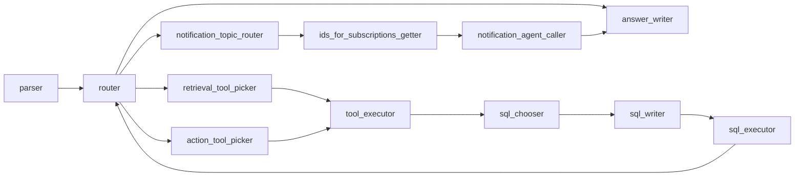

# Architecture

## Runtime model

The application is a **single Azure Functions host** process loading all functions. Each function is isolated at the Azure resource configuration level but shares **one codebase** and **one `config.py` import graph**. Cold start and scaling behaviour follow Azure’s consumption/premium plans.

## Feature 01 — LangGraph agent (`collabgpt_lg`)

**Flow.** HTTP `main` constructs `GraphLogisticsBot`, parses `userQuery`, then `GraphLogisticsBot._run_graph` streams events from the compiled graph (`collabgpt_lg/graph.py`).

**Entry and routing.**

- `parser` — normalises user text with glossary-aware prompt (`get_parser_prompt`).
- `router` — structured `Route` output; caps router revisits (`router_visits_counter > 2` forces `answer_writer`); can branch to **notification** subgraph when `NOTIFICATION AGENT` appears in `processed_query` and Langflow + allow-list permit.
- `retrieval_tool_picker` / `action_tool_picker` — choose LangChain tools from `tool_maps_by_org` (`collabgpt_lg/tools.py`).
- `tool_executor` — executes tools (many async endpoints wrapped with `asyncio.run` inside tool functions).
- `sql_chooser` → `sql_writer` → `sql_executor` — optional DuckDB SQL over datasets in `state['data']` (`process_dataset_with_sql` in `collabgpt_lg/tools.py`).
- `answer_writer` — final natural language response.
- Notification subgraph: `notification_topic_router`, `ids_for_subscriptions_getter`, `notification_agent_caller` (Langflow `NotificationAgent` in `collabgpt_lg/endpoints.py`).

**State.** `GraphState` in `collabgpt_lg/graph_types.py` holds message history, tool outputs, LLM telemetry, subscription-topic structs, etc. Reducers merge streamed updates (`apply_reducers`).

**Org boundaries.** Endpoint classes in `collabgpt_lg/endpoints.py` inherit from bases in `collabgpt_lg/endpoints_base.py` and typically validate `supported_orgs` — this is the second layer of org control after `tools_by_org` (`collabgpt_lg/tools.py` comment warns of this duplication).

**Vor Search index tools (feature 01).** For **Shell UK** and **ExxonMobilGuyana**, several `find_*` tools call dedicated **Vor Search** HTTP indexes (`VorSearchBaseClass._query_pipeline` in `collabgpt_lg/endpoints_base.py`): index hits are optionally merged with **Data Enhancer** or **Customer API** detail (`non_index_data_pipeline` / `non_index_api_dispatcher_by_org` in `collabgpt_lg/tools.py`). Chevron continues to use **VOR AI Search** for the same tool names where applicable; `RoadTransportJobsVorSearch` exists for Chevron in `endpoints.py` but is not exposed in `tools_by_org` yet. **`VoyagesByDescriptionVorSearch.query`** short-circuits an all-digit `search_term` through **`VoyagesByID`** before the index pipeline.

**Org config (`collabgpt_lg/org_config.py`).** `vor_search_result_filters` and `vor_url_list` live here (imported by `prompts.py` and `endpoints.py`) so `prompts.py` can reference `apis_by_org` from `collabgpt_check_subscriptions` without a circular import.

**Tool outputs to the router.** `trim_data` in `collabgpt_lg/utils.py` compresses tool payloads for routing but retains `status` and `system_message` on dict outputs.

**Notification topic router (feature 02 in-graph).** `get_notification_topic_router_prompt` in `collabgpt_lg/prompts.py` partial-injects subscribeable entity-type names from `apis_by_org[org]` and documents unsupported subscription patterns.

## Feature 02 — Subscriptions

**Timer path** (`collabgpt_check_subscriptions/__init__.py`): for each org in `UA_NOTIFICATION_AGENT_ALLOW_LIST`, loads active subscriptions via `ActiveSubscriptions`, fetches entity payloads via org-specific API classes, diffs against Redis-backed cache, enqueues per-subscription messages to `SUBSCRIPTION_QUEUE`.

**Queue path** (`collabgpt_check_subscription_queue/__init__.py`): deserialises queue JSON, calls `assess_diff` (Langflow subscription agent + LLM), updates Redis caches for past notifications and closure scheduling, emits Mixpanel events.

## Feature 03 — Index ingestion

Timer or HTTP functions pull from **Data Enhancer** or **Redis**, map documents through the same shaping logic as interactive APIs where applicable (`FlightsByID._data_mapping`, etc.), then POST batches via `IndexUploader` to URLs from `config.ai_search.url.*_indexing`.

## Feature 06 — PO shipments timer (`collabgpt_po_shipments_trigger`)

**Dormant.** This timer still exists in the repo but targeted **Flowise**, which has been **decommissioned** in favour of **LangFlow**. The PO overdue flow was **not ported** to LangFlow until it is needed again, so the function should be treated as **inactive** from a product perspective even if the schedule remains deployed.

## Shared cross-cutting

- **Authentication**: pattern-specific (OAuth client credentials for AI Search / Vor Search; bearer token chain for Customer API; username/password for Data Enhancer). See `endpoints_base.py`.
- **Observability**: Python `logging` to stdout; `@slack_logging` on most entrypoints; Application Insights sampling configured in `host.json`.
- **IDs**: `shared/ids/all_regexes.py` and per-org modules feed `GraphLogisticsBot.extract_reference_numbers`.

## Diagram (LangGraph high level)

LangGraph can render the **compiled** graph to a PNG: the checked-in export is `collabgpt_lg/tests/graph.png` (from `graph_builder().compile().get_graph().draw_mermaid_png()`). To regenerate after structural changes, uncomment and run the snippet at the bottom of `collabgpt_lg/graph.py` (same path as in that file: `tests/graph.png` relative to `collabgpt_lg`).

Similar mermaid sketch (only slightly less info).

## Related feature IDs

- 01 — VOR AI HTTP
- 02 — Subscriptions
- 03 — CHEVRON index ingestion
- 04 — LS warnings HTTP
- 05 — Vessels / AIS HTTP
- 06 — PO shipments timer (dormant; legacy Flowise, not yet replaced in LangFlow)

